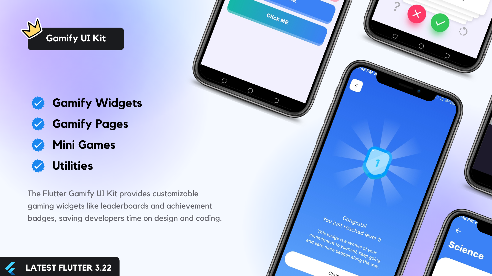
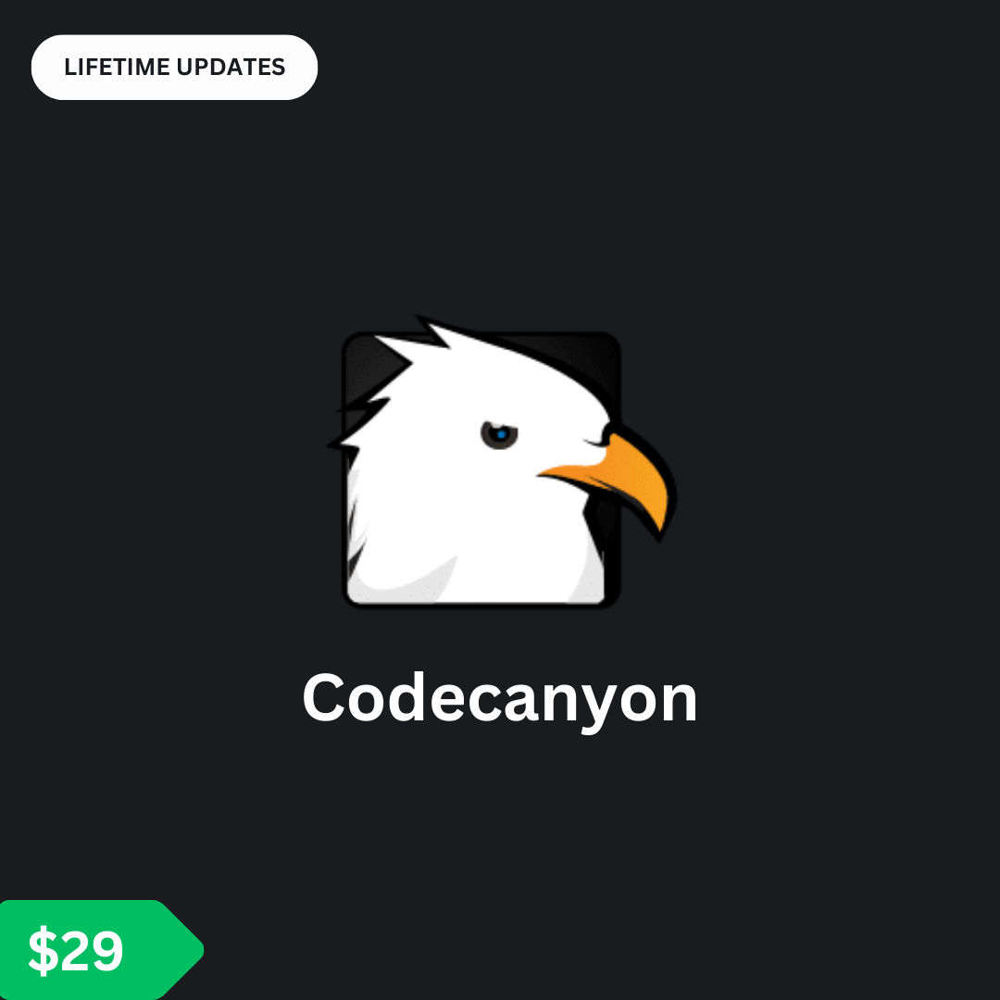
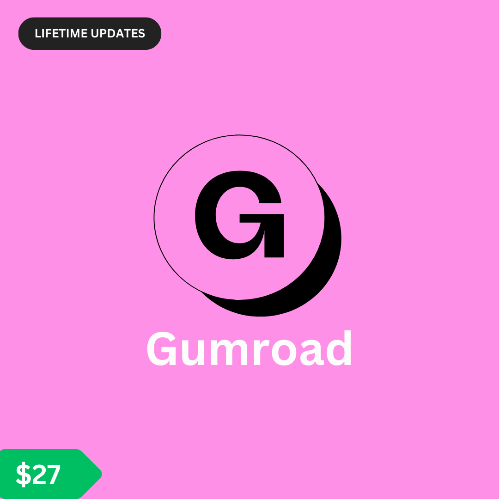
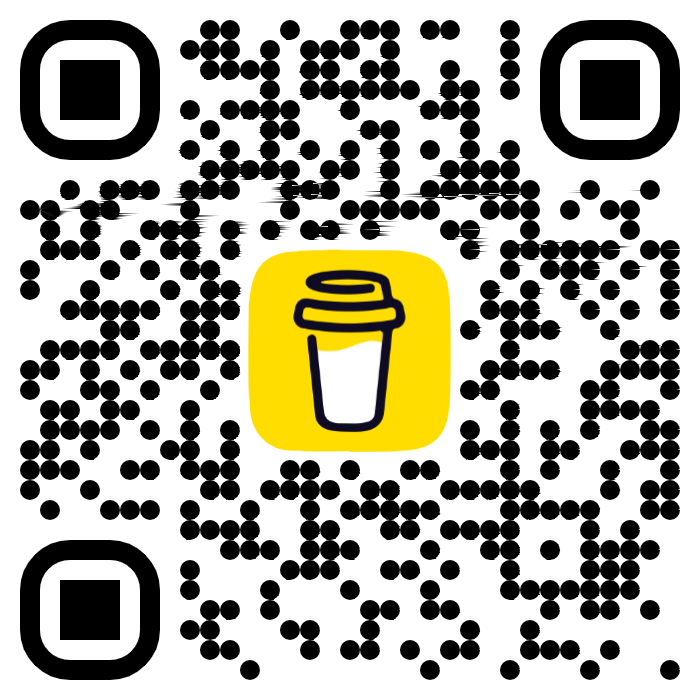

# Flutter packages

Here is a list of available packages:

1. [**Rounded Avatar**](./packages/rounded_avatar/)

## Sponsor: Gamify UI Kit

    
    

## Support

If you find this package useful, consider buying me a coffee to support further development.

## 🛡️ License

This project is licensed under the Apache License 2.0